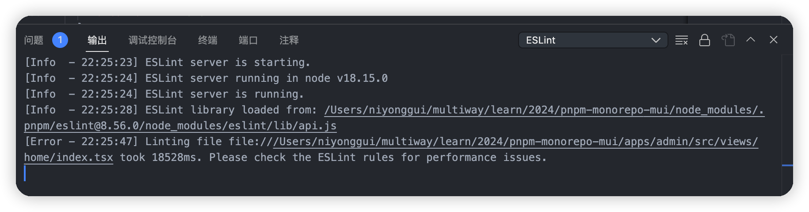

---
nav:
  title: 帮助
  order: 3
group:
  title: 开发环境
  order: -1
---

#

## 新项目创建

当 dumi 提供的默认主题无法满足项目需要时，即可选择对 dumi 的默认主题进行局部定制或全部定制。先来看一下主题包应有的目录结构。

## 组件库使用

eslint 问题。

时候版本升级挺令人沮丧的，包的升级有时候会伴随着 vscode 无法启动 eslint server 的问题，这时候，最好检查输出控制台，切换到 eslint，看是否正常启动 eslint 检验
